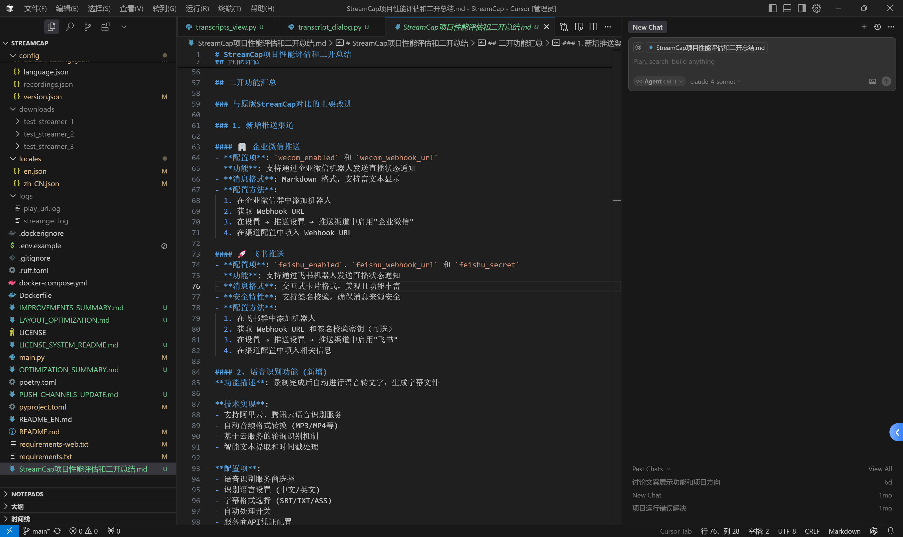

# `Cursor × 开源项目`

  <h2 class="text-2xl font-mono font-bold mb-4 text-cyan-400">从零到一的开源实践之路</h2>
  

    
分享人：石子健

    
Powered by Cursor

  

---

# `👋 关于我`

  

    

      

        
主业： 财务

        
身份： AI探索者 & 开源拥护者

        
专长： AI编程 | AI工作流 | 低代码开发

        
平台： n8n | Dify | Coze

        
经验： AI工作流、智能体落地实战

      

    

  

  
  

    

      👨‍💻
    

    
// 不务正业的财务

  

---

# `📋 分享内容`

  

    <h3 class="text-xl font-mono font-bold mb-3 text-blue-400">⚡ 开源项目二次开发</h3>
    <ul class="text-base font-mono space-y-2">
      <li class="flex items-center text-gray-300">> 小白也能看懂复杂代码</li>
      <li class="flex items-center text-gray-300">> 不懂技术照样能改功能</li>
      <li class="flex items-center text-gray-300">> Cursor全自动编写代码</li>
    </ul>
  

  
  

    <h3 class="text-xl font-mono font-bold mb-3 text-green-400">🚀 落地首个开源项目</h3>
    <ul class="text-base font-mono space-y-2">
      <li class="flex items-center text-gray-300">> 从想法到实现</li>
      <li class="flex items-center text-gray-300">> 开发过程实录</li>
      <li class="flex items-center text-gray-300">> 项目成果展示</li>
    </ul>
  

---

# `🎥 开源项目 StreamCap`

  

    
开源直播监控 & 录制工具

  

  

    

      <h3 class="text-lg font-mono font-bold mb-3 text-blue-400">📦 项目信息</h3>
      

        
类型： 流媒体工具

        
功能： 监控 | 录制 | 推送

        
平台： 抖音 | YouTube | 全球平台

      

    

  

  

    

      <h3 class="text-lg font-mono font-bold mb-3 text-green-400">⚡ 二开功能</h3>
      

        
+ AI直播文案识别

        
+ 飞书 & 企业微信推送

        
+ UI界面重构优化

      

    

  

---

# `📊 二开成果展示`

  

    
二开前后效果对比

  

  

    <h3 class="text-lg font-mono font-bold mb-3 text-center text-blue-400">🔴 原版功能</h3>
    

      <video controls class="w-full rounded" style="max-height: 400px;">
        <source src="./assets/before-demo.mp4" type="video/mp4">
        
浏览器不支持视频

      </video>
    

  

  
  

    <h3 class="text-lg font-mono font-bold mb-3 text-center text-green-400">🟢 二开版本</h3>
    

      <video controls class="w-full rounded" style="max-height: 400px;">
        <source src="./assets/after-demo.mp4" type="video/mp4">
        
浏览器不支持视频

      </video>
    

  

---

# `🛠️ Cursor 二开实录`

  

    
开发过程展示

  

  

    <h3 class="text-base font-mono font-bold mb-3 text-center text-blue-400">🔍 代码展示</h3>
    

      
    

  

  

    <h3 class="text-base font-mono font-bold mb-3 text-center text-green-400">⚡ 文件展示</h3>
    

      
    

  

---

# `⚡ 开发方式对比`

  

    
传统开发 vs Cursor驱动开发

  

  

    <h3 class="text-lg font-mono font-bold mb-3 text-center text-cyan-400">📊 方法论对比</h3>
    

      

        <h4 class="font-mono font-bold text-blue-400 mb-2 text-sm text-center">❌ 传统方式</h4>
        

          
× 学习框架语法

          
× 理解整个架构

          
× 环境配置调试

          
× 数月学习周期

        

      

      

        <h4 class="font-mono font-bold text-green-400 mb-2 text-sm text-center">✅ Cursor方式</h4>
        

          
✓ 直接描述需求

          
✓ AI智能解释

          
✓ 自动生成代码

          
✓ 小时级完成

        

      

    

  

  
  

    
🚀 人人都能成为开发者！

  

---

# `🚀 我的开源项目`

  

    <h2 class="text-2xl font-mono font-bold text-cyan-400">Dify-on-Qianniu</h2>
    
7x24小时 AI 客服自动化系统

  

  

    

      <h3 class="text-lg font-mono font-bold mb-3 text-blue-400">🚀 核心功能</h3>
      

        
> 智能消息监测

        
> AI内容识别

        
> 自动智能回复

      

    

  

  
  

    

      <h3 class="text-lg font-mono font-bold mb-3 text-green-400">🛠️ 技术栈</h3>
      

        
语言： Python

        
RPA： Clicknium

        
AI： Dify

      

    
   
  

---

# `📈 开发历程`

  

    
从想法到开源的完整历程

  

  

    
1

    

      <h4 class="font-mono font-bold text-blue-400 text-sm">💡 需求分析</h4>
      
Cursor主导需求分析与可行性评估

    

  

  
  

    
2

    

      <h4 class="font-mono font-bold text-green-400 text-sm">🏗️ 架构设计</h4>
      
Cursor主导技术选型和架构规划

    

  

  
  

    
3

    

      <h4 class="font-mono font-bold text-cyan-400 text-sm">⚡ 快速开发</h4>
      
Cursor全自动编写代码

    

  

  
  

    
4

    

      <h4 class="font-mono font-bold text-blue-400 text-sm">🚀 发布上线</h4>
      
Cursor指导GitHub开源发布

    

  

---

# `💬 开发实录`

  

    
Cursor驱动的对话式开发

  

  

    <h3 class="text-base font-mono font-bold mb-3 text-center text-blue-400">🎯 代码展示</h3>
    

      
    

  

  

    <h3 class="text-base font-mono font-bold mb-3 text-center text-green-400">🔧 文件展示</h3>
    

      
    

  

---

# `🎯 项目成果展示`

  

    <h3 class="text-lg font-mono font-bold mb-3 text-center text-blue-400">📦 GitHub开源</h3>
    

      
    

  

  

    <h3 class="text-lg font-mono font-bold mb-3 text-center text-green-400">📱 AI客服落地</h3>
    

      

        
      

    

  

---

# `📝 总结与展望`

  

    <h2 class="text-xl font-mono font-bold text-cyan-400">从实践到思考的完整闭环</h2>
  

  

    <h3 class="text-xl font-mono font-bold mb-4 text-center text-blue-400">🎯 核心收获</h3>
    <ul class="space-y-3 text-base font-mono">
      <li class="flex items-center text-gray-300">🔓 破圈突破： 财务人也能写代码</li>
      <li class="flex items-center text-gray-300">⚡ 效率飞跃： 从月级到小时级开发</li>
      <li class="flex items-center text-gray-300">🌟 价值创造： 1个开源项目落地</li>
    </ul>
  

  
  

    <h3 class="text-xl font-mono font-bold mb-4 text-center text-green-400">🔮 未来规划</h3>
    <ul class="space-y-3 text-base font-mono">
      <li class="flex items-center text-gray-300">🤖 深度协同： 探索与Cursor协同</li>
      <li class="flex items-center text-gray-300">🔍 开源挖掘： 挖掘和参与开源项目</li>
      <li class="flex items-center text-gray-300">💰 商业探索： 寻找商业化机会</li>
    </ul>
  

---

# `🎬 结语`

  

    <h2 class="text-xl font-mono font-bold text-cyan-400">用Cursor重新定义开发</h2>
  

  
感谢聆听，期待与你一起探索AI时代的无限可能

  
// 让每个想法都有实现的机会

  <h3 class="text-xl font-mono font-bold mb-4 text-center text-cyan-400">📱 联系方式</h3>
  <ul class="space-y-3 text-base font-mono">
    <li class="flex items-center text-gray-300">📖 小红书： Excel办公不求人</li>
    <li class="flex items-center text-gray-300">🐙 GitHub： tmwgsicp</li>
    <li class="flex items-center text-gray-300">📧 邮箱： creator@waytomaster.com</li>
  </ul>

